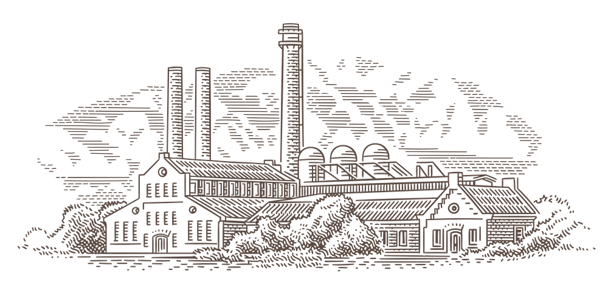

# Manufacturable

Manufacturable is a factory that builds self-registering objects.

It leverages self-registration to move factory setup from case statements,
hashes, and configuration files to a simple DSL within the instantiable
classes themselves. Giving classes the responsibility of registering
themselves with the factory does two things. It allows the factory to be
[extended without modification][ocp]. And, it leaves the factory with only
[one responsibility][srp]: building objects.

## Motivation

We wrote Manufacturable so we wouldn't have to keep modifying our factory
code every time we needed to add functionanlity to our applications. For
example, consider this factory:

```ruby
class AutomobileFactory
  def self.build(type, *args)
    case type
    when :sedan
      Sedan.new(*args)
    when :coupe
      Coupe.new(*args)
    when :convertible
      Convertible.new(*args)
    end
  end
end
```

If you want to start building `Hatchback` objects, you'll need to modify the
factory. To solve this problem in Ruby, factories are often built using
metaprogramming, like this:

```ruby
class AutomobileFactory
  def self.build(type, *args)
    Object.const_get(type.capitalize)&.new(*args)
  end
end
```

But, this very simple factory relies on a convention: the type symbol must
match the name of the class. This means that classes with namespaces, or
symbols with underscores will not work. In other words, you could not use the
symbol `:four_door` to build a `Sedan` object.

Manufacturable solves these problems by allowing classes to register themselves
with the factory using a key of their choosing. This means you never have to
modify the factory code again.

## Usage

### The Basics

A class may register itself with Manufacturable like this:

```ruby
class Sedan
  extend Manufacturable::Item

  corresponds_to :four_door
end
```

Extending `Manufacturable::Item` adds the Manufacturable DSL to the class.
Calling `corresponds_to` with a key registers that class with the factory.

Once registed, a class may be instantiated like this:

```ruby
Manufacturable.build(Object, :four_door, *args)
```

Note the first parameter. This is the parent class of the registered class.
In this case, the parent class happens to be `Object`. So, Manufacturable
registered the `Sedan` class under the `Object` namespace to prevent key
collision. To instantiate the `Sedan`, we need to request the `:four_door`
key from the `Object` namespace.

For convenience, Manufacturable provides an `ObjectFactory` to build objects
that are stored in the `Object` namespace:

```ruby
Manufacturable::ObjectFactory.build(:four_door, *args)
```

In most cases, though, your class will actually inherit from a specific class
other than `Object`. For example, it is likely that the `Sedan` class would
inherit from an `Automobile` class. If that were the case, you would pass
`Automobile` as the first parameter to `Manufacturable.build`:

```ruby
class Automobile
  extend Manufacturable::Item
end

class Sedan < Automobile
  corresponds_to :four_door
end

Manufacturable.build(Automobile, :four_door, *args)
```

That's all you need to know to begin using Manufacturable. But, it's not all
there is to know. Manunfacturable allows you to:

* [Configure your own factory classes](#using-factory-classes)
* [Define a default manufacturable item](#defining-a-default-manufacturable-item)
* [Register multiple classes under the same key within a namespace](#registering-multiple-classes-under-the-same-key-within-a-namespace)
* [Register a class to correspond with an entire namespace](#registering-a-class-to-correspond-with-an-entire-namespace)

### Using Factory Classes

Manufacturable also has a DSL for creating factories:

```ruby
class AutomobileFactory
  extend Manufacturable::Factory

  manufactures Automobile
end
```

Extending `Manufacturable::Factory` adds the DSL to the factory class.
Calling `manufactures` with a class designates it as the namespace for the
factory.

Once configured, you can use the `AutomobileFactory` to build objects from
classes in the `Automobile` namespace:

```ruby
AutomobileFactory.build(:four_door, *args)
```

### Defining a Default Manufacturable Item

What happens when Manufacturable is unable to find the key you're looking for?
That depends on what you tell Manufacturable. By default, it will return `nil`
when it does not find a class registered at a specific key. But, you can also
configure Manufacturable's response. This allows you to implement the [null
object pattern][nop].

```ruby
class NullAutomobile < Automobile
  default_manufacturable
end
```

Now, your calling code does not have to check for `nil` before calling a method
on the class:

```ruby
AutomobileFactory.build(:lemon, *args).drive
```

### Registering Multiple Classes Under the Same Key within a Namespace

Manufacturable allows you to register multiple classes under the same key:

```ruby
class StandardEngine < Component
  corresponds_to :sedan
end

class AutomaticTransmission < Component
  corresponds_to :sedan
end

class PowerfulEngine < Component
  corresponds_to :coupe
end

class ManualTransmission < Component
  corresponds_to :coupe
end
```

Then, when you request that key, you'll receive an array containing a new
instance of each class registered under that key.

```ruby
ComponentFactory.build(:sedan, *args)
  # => [#<StandardEngine:0x00007fad6c07e858>, #<AutomaticTransmission:0x00007fad6c07e808>]

ComponentFactory.build(:coupe, *args)
  # => [#<PowerfulEngine:0x00007fad6c07e858>, #<ManualTransmission:0x00007fad6c07e808>]
```

### Registering a Class to Correspond with an Entire Namespace

Manufacturable will also let you register a class that corresponds with all
of the keys in a namespace:

```ruby
class HeadLight < Component
  corresponds_to_all
end
```

Now, the `ComponentFactory` will include `HeadLight` objects for both the
`:sedan` and `:coupe`.

```ruby
ComponentFactory.build(:sedan, *args)
  # => [
  #  #<StandardEngine:0x00007fad6c07e858>,
  #  #<AutomaticTransmission:0x00007fad6c07e808>,
  #  #<HeadLight:0x00007fad6c07e667>
  # ]

ComponentFactory.build(:coupe, *args)
  # => [
  #  #<PowerfulEngine:0x00007fad6c07e858>,
  #  #<ManualTransmission:0x00007fad6c07e808>,
  #  #<HeadLight:0x00007fad6c07e667>
  # ]
```

## Installation

Add this line to your application's Gemfile:

```ruby
gem 'manufacturable'
```

And then execute:

    $ bundle install

Or install it yourself as:

    $ gem install manufacturable

If you are using Manufacturable with Rails, you'll need an initializer to tell
manufacturable where the classes are so they can be autoloaded.

```ruby
Manufacturable.config do |config|
  config.paths << Rails.root.join('app', 'automobiles')
  config.paths << Rails.root.join('app', 'components')
end
```

## Development

After checking out the repo, run `bin/setup` to install dependencies. Then,
run `rake spec` to run the tests. You can also run `bin/console` for an
interactive prompt that will allow you to experiment. To install this gem
onto your local machine, run `bundle exec rake install`.

## Contributing

Bug reports and pull requests are welcome on [GitHub][git].

## License

The gem is available as open source under the terms of the [MIT License][mit].

## Code of Conduct

Everyone interacting in the Manufacturable project's codebases, issue trackers,
chat rooms and mailing lists is expected to follow the [code of conduct][cod].

## Acknowledgements

Manufacturable was inspired by work we did at Entelo on [Industrialist][ind].
We will be forever grateful to the people at Entelo for giving us the
opportunity to work on things we're still proud of today.

[srp]: https://en.wikipedia.org/wiki/Single-responsibility_principle
[ocp]: https://en.wikipedia.org/wiki/Open-closed_principle
[nop]: https://en.wikipedia.org/wiki/Null_object_pattern
[gem]: https://rubygems.org
[git]: https://github.com/first-try-software/manufacturable
[cod]: https://github.com/first-try-software/manufacturable/blob/master/CODE_OF_CONDUCT.md
[mit]: https://opensource.org/licenses/MIT
[ind]: https://github.com/entelo/industrialist